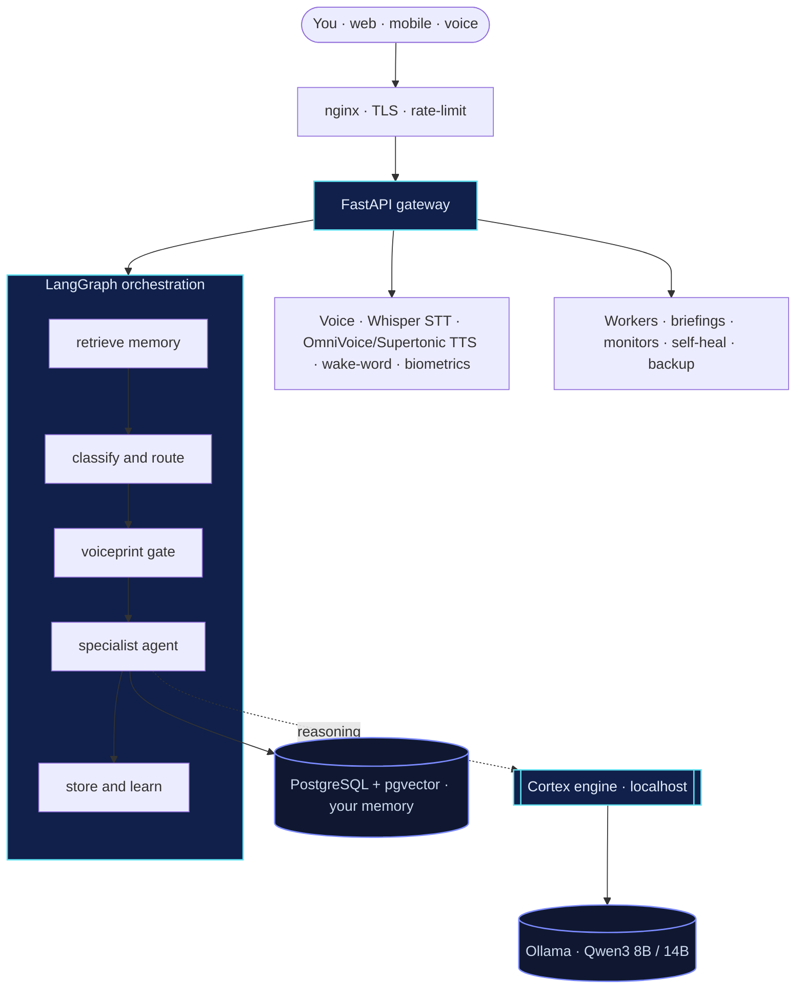

<div align="center">



<br/>

[](https://github.com/Praveenkumar101508)
[](#)
[](#)
[](#)
[](#)
[](#)

### Your AI. Your hardware. Your rules. **Forever.**

IRA is a private, sovereign AI assistant that lives entirely on **your own machine** — chat, voice, memory, and reasoning. No subscriptions, no cloud vendor, no data ever leaving your server.

</div>

---

## See it in action

<div align="center">



<sub>A live loop of IRA taking a request, routing it to the right agent, and streaming a reply — all local.</sub>

<!-- Want a real screen recording instead? Record your running app, drag the .mp4/.gif into a GitHub issue,
     copy the uploaded URL, and replace the  above with it. -->

</div>

---

## Why IRA exists

Most "AI assistants" ship your most private data — your email, calendar, voice, and notes — to someone else's servers, behind a monthly bill you don't control. IRA flips that. Every model runs locally on [Ollama](https://ollama.com), every memory lives in your own database, and the reasoning engine is bound to `localhost`. The result is an assistant you fully own — capable enough to be useful, private enough to trust with everything.

> **The one rule the architecture enforces:** nothing leaves your machine unless *you* wire up an integration and turn it on.

---

## What it can do

A request is routed to the right specialist automatically — you just talk to IRA.

| Agent | What it does for you |
|---|---|
| 💬 **Conversational** | Everyday chat, drafting, and quick answers in IRA's voice |
| 🔎 **Researcher** | Deep research across web, search, RSS, GitHub & YouTube — sources kept honest |
| 🛠️ **Engineer** | Reads your code, plans a fix, and returns clean unified diffs |
| 📐 **Architect** | Turns an approved idea into apply-ready changes — *proposes only, never auto-pushes* |
| ⚙️ **Executor** | Runs read-only system commands behind a strict safety gate |
| 🛡️ **Security** | Classifies security events by severity and recommends the fix |
| 🎯 **Career** | CV tailoring, job-fit analysis, GitHub review, recruiter drafts |
| ✨ **Creator** | Builds brand-new skills for IRA on demand |
| 🖥️ **Digital** | Your "digital hands" — apps, browser, terminal, files |
| 🎓 **Tutor** | Socratic technical teaching — guides, never just hands over the answer |
| 🌐 **Website** | Runs the SupraCloud site — leads, bookings, reports |
| 🧭 **Strategy / Expert** | Deliberation, calibration, and look-ahead for hard decisions |

Plus a **voice layer** (speak to it, it speaks back, an owner-gated wake word, and only *your* voiceprint unlocks sensitive topics), a **local-first actions surface** (IMAP email triage, CalDAV calendar, on-disk notes — every destructive or outbound action gated behind explicit confirmation), an optional **mobile companion** (Expo PWA + push, off by default), and **8 background workers** that brief you each morning, watch for issues, heal the system, and back it up — without being asked.

---

## Architecture



Every user turn flows through the same pipeline: **recall relevant memory → route to a specialist → check the voiceprint gate → answer → learn from it.** Conversation state survives restarts; the reasoning engine never talks to anything outside `127.0.0.1`.

---

## Security — defense in depth

IRA is built to be exposed to the internet without flinching. The model isn't "one wall" — it's layers, so a breach of any one still hits the next, gets logged, and is contained.

| Layer | Protection | Status |
|---|---|---|
| **Identity** | JWT + bcrypt, constant-time login, TOTP 2-factor | ✅ live |
| **Sessions** | Short-lived tokens, `jti` revocation, instant logout-all, opt-in fail-closed-on-Redis | ✅ live |
| **Brute force** | Per-IP rate limiting + per-account exponential lockout | ✅ live |
| **Owner authorization** | Verified-owner checked *inside* every sensitive tool (email, calendar, security) — fail-closed, not just at the classifier | ✅ live |
| **Self-modification** | Architect apply path owner-gated; protected-paths denylist refuses any patch touching auth / safety / router / config / CI | ✅ live |
| **Outbound (SSRF)** | Single hardened guard (`net_safety`) — DNS-rebinding, IPv4-mapped IPv6, decimal/hex/`0.0.0.0` literal bypasses all closed | ✅ live |
| **Exfiltration** | Egress guard blocks secrets / keys / local paths leaving | ✅ live |
| **Reasoning engine** | Reasoning-only skills run the local engine with tools disabled (`--accept-hooks` dropped + enforced no-tools wrapper) | ✅ live |
| **Commands** | Two-gate allowlist, shell-free execution, allow-roots resolved at call time | ✅ live |
| **Actions** | Draft → confirm approval for every side-effect | ✅ live |
| **Prompt injection** | Web & tool output treated as data, never instructions | ✅ live |
| **Tripwires** | Canary tokens fire instantly on any intruder touch | ✅ live |
| **Detection** | Live monitor → security events → Telegram/email alerts | ✅ live |
| **Response** | Bounded auto-playbooks (block IP, rotate, snapshot) | ✅ live |
| **Exposure guard** | `DEV_MODE` refused on a non-loopback bind host unless explicitly opted in (domain label alone isn't trusted) | ✅ live |
| **Data at rest** | Owner-held-key vault + encrypted secrets | 🚧 roadmap |

> The self-modifying paths can *propose* changes, never silently ship them: an **AST CI check** fails the build on any `git push` — including the `["git", "push"]` arg-vector form a literal string-grep would miss — and the architect's apply pipeline refuses outright to patch its own security surface.

---

## Tech stack

<div align="center">


</div>

- **Reasoning** — local Ollama (Qwen3 8B fast / 14B deep) behind the **Cortex** out-of-process engine; reasoning-only skills run with the toolset disabled
- **Memory** — PostgreSQL + pgvector (HNSW), local embeddings + reranker, per-owner isolation
- **Voice** — Whisper STT, OmniVoice / Supertonic / Kokoro TTS, ECAPA voiceprint gate, owner-gated wake word, Indic language support
- **Actions** — local-first IMAP email triage, CalDAV calendar, on-disk notes — all confirmation-gated
- **Frontend** — Next.js 14.2 PWA (installable on phone or desktop) + an optional Expo mobile companion
- **Quality** — 600+ tests (incl. adversarial injection & owner-gate suites), two CI workflows (full suite + prod-deps resolution gate), Dependabot

---

## Quick start

```bash
# 1. clone
git clone https://github.com/Praveenkumar101508/Supracloud_ira.git
cd Supracloud_ira/supracloud-jarvis

# 2. configure (copy the template, fill in your values — nothing here phones home)
cp .env.example .env

# 3a. native (recommended on your own box) — Windows
./start-ira.ps1

# 3b. or containerised, for a scale-out box
docker compose -f docker-compose.cloud.yml up -d
```

Then open the app, enrol your voice + TOTP, and say hello. Full setup notes live in [`LOCAL_SETUP.md`](supracloud-jarvis/LOCAL_SETUP.md) and [`TAILSCALE_SETUP.md`](supracloud-jarvis/TAILSCALE_SETUP.md).

---

## Project layout

```text
supracloud-jarvis/
├─ ira/
│  ├─ agents/        # the specialist agents + the LangGraph
│  ├─ api/           # FastAPI routes + auth middleware
│  ├─ actions/       # local-first email / calendar / notes (confirmation-gated)
│  ├─ research/      # deep web-research engine (sanitised, egress-guarded)
│  ├─ memory/        # pgvector store, embeddings, reranker
│  ├─ voice/         # STT, TTS, voiceprint gate, wake word, languages
│  ├─ worker/        # briefings, monitors, self-heal, backup
│  ├─ utils/         # safety (net_safety, cmd_safety), security, playbooks, tools
│  ├─ skills/        # per-agent prompts (SKILL.md)
│  ├─ subagents/     # Expert-Mode deliberation team
│  ├─ scripts/       # CI guards (e.g. AST no-push check)
│  └─ cortex_bridge.py   # local reasoning gateway
├─ frontend/         # Next.js 14.2 PWA
├─ mobile/           # optional Expo companion app (off by default)
├─ postgres/         # schema migrations
├─ third_party/      # vendored deps + upstream LICENSE/NOTICE
└─ docs/             # ops + incident runbooks
```

---

## Roadmap

- [x] Multi-agent core, voice, memory, proactive workers
- [x] Full defense-in-depth security layer + live monitoring
- [x] Local-first actions (email · calendar · notes) + optional mobile companion
- [x] Tool-layer owner authorization + self-modification guardrails
- [ ] Owner-held-key encryption vault (data at rest)
- [ ] Passkeys / WebAuthn login
- [ ] Global lockdown kill-switch
- [ ] Voice-controlled coding agent

---

<div align="center">
<sub>Built and owned by <b>Praveen Kamineti</b> · part of the <b>SupraCloud</b> sovereign-AI vision.</sub>
<br/>
<sub>Private repository — © all rights reserved.</sub>
</div>
