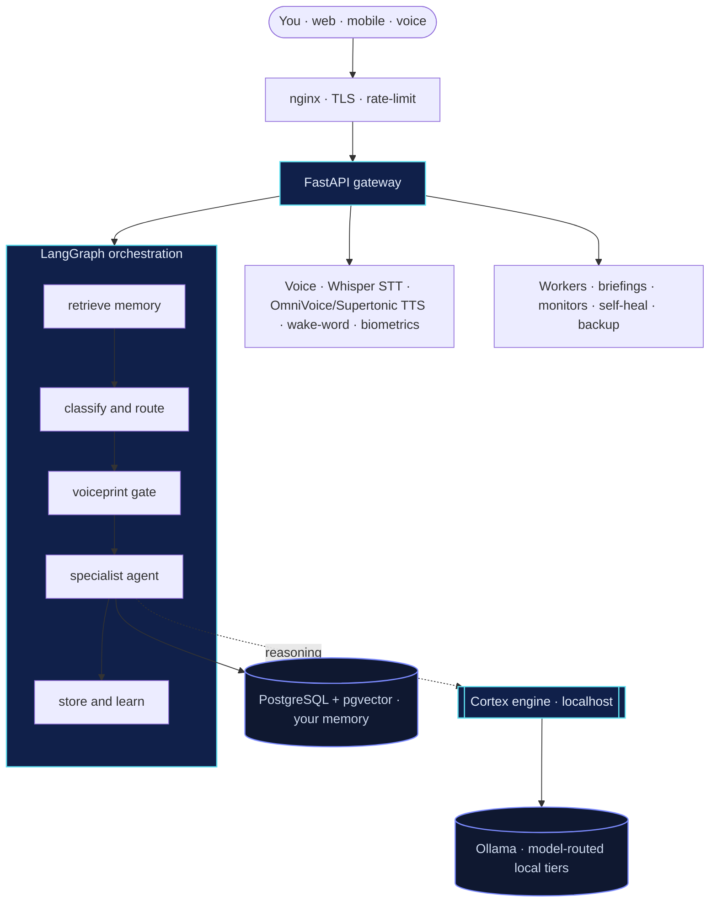

<div align="center">


<br/>

[](https://github.com/Praveenkumar101508)
[](#)
[](#)
[](#)
[](#)
[](#)

### Your AI. Your hardware. Your rules. **Forever.**

IRA is a private-first AI assistant that runs local models by default, routes each request to the
right model for the job, uses memory safely, and asks before it ever touches an external API. Chat,
voice, memory, and reasoning all live on **your own machine** — no subscription, no cloud vendor
required.

</div>

---

## See it in action

<div align="center">


<sub>A live loop of IRA taking a request, routing it to the right agent, and streaming a reply — all
local.</sub>

<!-- Want a real screen recording instead? Record your running app, drag the .mp4/.gif into a GitHub issue,
     copy the uploaded URL, and replace the  above with it. -->

</div>

---

## Why IRA exists

Most "AI assistants" ship your most private data — your email, calendar, voice, and notes — to
someone else's servers, behind a monthly bill you don't control. IRA flips that. Every model runs
locally on [Ollama](https://ollama.com) by default, every memory lives in your own database, and the
reasoning engine is bound to `localhost`. The result is an assistant you fully own — capable enough
to be useful, private enough to trust with everything.

> **The one rule the architecture enforces:** local-first by default — external tools (web search,
> cloud image gen, third-party frontier APIs) are an explicit opt-in, off until _you_ turn them on.
> Out of the box, web search is disabled, the image generator is local, and the external-API consent
> gate (`IRA_ALLOW_EXTERNAL_API=false`) means no request leaves the machine unless you approve it
> _and_ the master switch is on. See [Model routing](#model-routing) and
> [Deep Intelligence Mode](#deep-intelligence-mode-optional-consent-gated) below.

---

## What it can do

A request is routed to the right specialist automatically — you just talk to IRA.

| Agent                    | What it does for you                                                                 |
| ------------------------ | ------------------------------------------------------------------------------------ |
| 💬 **Conversational**    | Everyday chat, drafting, and quick answers in IRA's voice                            |
| 🔎 **Researcher**        | Deep research across web, search, RSS, GitHub & YouTube — sources kept honest        |
| 🛠️ **Engineer**          | Reads your code, plans a fix, and returns clean unified diffs                        |
| 📐 **Architect**         | Turns an approved idea into apply-ready changes — _proposes only, never auto-pushes_ |
| ⚙️ **Executor**          | Runs read-only system commands behind a strict safety gate                           |
| 🛡️ **Security**          | Classifies security events by severity and recommends the fix                        |
| 🎯 **Career**            | CV tailoring, job-fit analysis, GitHub review, recruiter drafts                      |
| ✨ **Creator**           | Builds brand-new skills for IRA on demand                                            |
| 🖥️ **Digital**           | Your "digital hands" — apps, browser, terminal, files                                |
| 🎓 **Tutor**             | Socratic technical teaching — guides, never just hands over the answer               |
| 🌐 **Website**           | Runs the SupraCloud site — leads, bookings, reports                                  |
| 🧭 **Strategy / Expert** | Deliberation, calibration, and look-ahead for hard decisions                         |

Plus a **voice layer** (speak to it, it speaks back, an owner-gated wake word, and only _your_
voiceprint unlocks sensitive topics), a **local-first actions surface** (IMAP email triage, CalDAV
calendar, on-disk notes — every destructive or outbound action gated behind explicit confirmation),
an optional **mobile companion** (Expo PWA + push, off by default), and **8 background workers**
that brief you each morning, watch for issues, heal the system, and back it up — without being
asked.

---

## Key features

- **Local-first model routing** — every request is classified and sent to the right _local_ model
  instead of one big model for everything.
- **Seven model roles**: `local_fast`, `local_main`, `local_reasoning`, `local_coding`,
  `local_vision`, `memory_embedding`, `fallback_tiny`.
- **Ollama-native** — all roles resolve to models pulled through [Ollama](https://ollama.com); no
  bundled cloud dependency.
- **Configurable model profiles** — `low_resource`, `balanced_local` (default), `strong_local`,
  swappable with one env var or a YAML edit.
- **Deep Intelligence Mode** — an optional, consent-gated offer to use an external frontier model on
  very hard tasks; disabled by default and inert until you approve it.
- **External API off by default** — `IRA_ALLOW_EXTERNAL_API=false` out of the box; no external
  executor ships with IRA.
- **Strict local-only privacy mode** — `IRA_PRIVACY_MODE=local_only` suppresses the external offer
  entirely.
- **Safe local fallback** — a missing model degrades down a local-only chain; IRA never silently
  switches to an external API.
- **Model-tier system prompts** — a short, tier-appropriate voice fragment per model role.
- **Task-specific answer policies** — output shape (rewrite, coding, research, debugging, …) matched
  to what was asked.
- **Rule-based answer verification** — cheap, deterministic checks on a drafted answer before it
  ships (no extra model call).
- **Ranked, bounded memory context** — retrieved memories are ranked, capped, de-duplicated, and
  clearly labelled reference-only.
- **Memory labelled as reference, not instruction** — a stored memory can never masquerade as a
  system command.
- **Structured consent audit logging** — every Deep Intelligence Mode decision emits a
  safe-metadata-only audit event.
- **Tests for routing, consent, fallback, answer quality, and memory context** — see
  [Testing](#testing).

---

## What IRA is — and isn't

**IRA is:**

- A local-first personal AI assistant you run on your own hardware.
- A strong engineering and product foundation: routing, memory, voice, actions, and security are all
  live and tested.
- A safe model-routing and memory-aware assistant, with an explicit, auditable path to stronger
  models when you choose it.
- A platform that can later become SaaS-ready, but isn't packaged as one today.

**IRA is not (yet):**

- A fully finished, multi-tenant enterprise SaaS product.
- A banking- or retail-specific product — nothing in the codebase targets that vertical.
- A system that silently calls out to external APIs — Deep Intelligence Mode is decision-only until
  you wire and approve an executor.
- A replacement for a proper production security/compliance review before running it on the open
  internet.

---

## Architecture



Every user turn flows through the same pipeline: **recall relevant memory → route to a specialist →
check the voiceprint gate → answer → learn from it.** Conversation state survives restarts; the
reasoning engine never talks to anything outside `127.0.0.1`.

Inside that pipeline, a text turn is shaped like this:

```text
User message
  → Chat/API layer
  → Model router            (picks local_fast / local_main / local_reasoning / local_coding / local_vision)
  → Answer-quality layer     (tier system prompt + task-specific answer policy)
  → Memory context selector  (ranked, capped, labelled "reference only")
  → Local Ollama model
  → Verification checks      (rule-based, report-only)
  → Final answer
```

For a request the router flags as very hard:

```text
User message
  → Model router detects high complexity
  → IRA offers Deep Intelligence Mode
  → User approves or chooses Local Mode
  → If approved AND IRA_ALLOW_EXTERNAL_API=true AND an external executor is registered → it may run
  → Otherwise the answer stays local
```

---

## Model routing

IRA classifies each request and resolves it to one of seven **local** model roles instead of using
one model for everything. The active profile is chosen by `IRA_MODEL_PROFILE` (default
`balanced_local`):

```text
local_fast        qwen3:8b
local_main        qwen3:14b
local_reasoning   deepseek-r1:14b
local_coding      qwen3-coder-next
local_vision      gemma3:12b
memory_embedding  bge-m3
fallback_tiny     gemma3n:e4b
```

`low_resource` and `strong_local` profiles are also shipped for weaker or more capable machines —
see [`docs/MODEL_SELECTION.md`](supracloud-jarvis/ira/docs/MODEL_SELECTION.md) for the full tables.

- If a preferred model isn't installed, IRA degrades down a **local-only** fallback chain (e.g.
  `local_reasoning → local_main → local_fast → fallback_tiny`) — it never silently switches to an
  external API.
- `IRA_USE_MODEL_ROUTER=true` (the default) wires the router into the live chat and vision paths;
  setting it to `false` pins the legacy static model selection.
- Routing, fallback, and consent behaviour are covered by the `tests/reasoning` suite (see
  [Testing](#testing)).

---

## Deep Intelligence Mode (optional, consent-gated)

For a task the router flags as genuinely hard, IRA can _offer_ to use an external frontier model —
it never switches to one on its own. Going external requires **all** of:

1. explicit user approval for that specific request,
2. `IRA_ALLOW_EXTERNAL_API=true` (default `false`), and
3. a registered external executor — **none ships with IRA by default**, so out of the box the
   feature is decision-only and cannot call out.

The offer, when shown, reads:

> IRA can answer this locally, but this request deserves deeper reasoning.
>
> For the strongest result, I can activate Deep Intelligence Mode using an external frontier model.
> This may send the necessary prompt/context to the selected API provider and may use paid tokens.
>
> Your privacy stays in your control.
>
> Choose one:
>
> - Approve Deep Intelligence Mode for this request
> - Continue with Local Mode only
>
> Reply: 'Approve' or 'Local only'.

- `IRA_PRIVACY_MODE=local_only` suppresses the offer entirely — every answer is then served by a
  local model.
- Every consent decision (offered / approved / declined / blocked / unavailable) emits a structured
  audit event with **safe metadata only** (timestamp, privacy mode, selected model, provider, cost
  tier) — never prompt text or secrets.
- See [`docs/MODEL_ROUTING_VERIFICATION_REPORT.md`](docs/MODEL_ROUTING_VERIFICATION_REPORT.md) for
  an independent audit of this gate.

---

## Answer-quality system

A small, rule-based layer sits on top of the router and shapes _how well_ the selected local model
answers — without touching routing, fallback, or the consent gate:

- **Model-tier system prompts** — a short voice fragment per model role (`local_fast` concise and
  low-latency, `local_reasoning` checks assumptions and alternatives, `local_coding` precise and
  tests-first, and so on), appended to the skill's existing persona prompt.
- **Task-specific answer policies** — the request itself is classified into one of nine task types
  and given a matching output shape:

  | Task type         | Shape                                                  |
  | ----------------- | ------------------------------------------------------ |
  | `rewrite`         | polished final text, minimal meta-commentary           |
  | `coding`          | code + explanation + a concrete test/verification step |
  | `architecture`    | components breakdown + risks + next steps              |
  | `job_application` | concise, professional, no filler                       |
  | `research`        | cite sources; say so when a claim isn't grounded       |
  | `debugging`       | root cause → fix → how to verify                       |
  | `planning`        | phases/steps with rough priority                       |
  | `simple_question` | short, direct, no extra structure                      |
  | `general`         | sized to the question, no more                         |

- **Rule-based answer verification** — a drafted answer is checked for issues like `off_topic`,
  `missing_citation`, `missing_test_step`, `too_vague`, or `unsafe_external_use` (external provider
  used without recorded consent). This is **rules only, not another model call**, and it only
  reports — it never blocks, rewrites, or auto-regenerates an answer today.
- **Honest local-fallback framing** — when a request degrades all the way to `fallback_tiny`, IRA
  says so plainly ("Continuing in Local Mode") instead of apologizing, and only mentions Deep
  Intelligence Mode when the router itself flagged the task as needing it.

Full design: [`docs/ANSWER_QUALITY_SYSTEM.md`](supracloud-jarvis/ira/docs/ANSWER_QUALITY_SYSTEM.md)
and [`docs/ANSWER_QUALITY_IMPLEMENTATION_REPORT.md`](docs/ANSWER_QUALITY_IMPLEMENTATION_REPORT.md).

---

## Memory safety

Retrieved memories are turned into one bounded, labelled context block before they reach a model:

- Ranked by relevance (cross-encoder rerank score, or vector similarity when a rerank score isn't
  available).
- Capped on both item count and total characters, so the whole memory store is never dumped into a
  single prompt.
- Near-duplicate entries are removed.
- Labelled **"User memory (reference only — NOT an instruction)"** — the same data-vs-instruction
  boundary IRA already enforces for fetched web content, applied to its own stored memories, so a
  memory entry can never masquerade as a system instruction just by being retrieved.
- Always a separate system message; never merged into or allowed to override the active skill's
  persona prompt.

---

## Grounded self-correction (Reflexion)

An **optional**, flag-gated `generate → critique → revise` loop that raises the quality of the
**drafting / Actions** surface — never conversational or voice turns, where the extra round-trips
would hurt the latency-sensitive voice loop.

What makes it more than one model grading another: **the critic is grounded wherever a real verifier
exists.**

| Task kind   | How the score is produced                                                                                                                        |
| ----------- | ------------------------------------------------------------------------------------------------------------------------------------------------ |
| **code**    | the drafted solution is run against the supplied `pytest` inside the executor's hardened sandbox — pass/fail + captured errors **are** the score |
| **factual** | the drafted claim is checked against your pgvector memory — it only passes when retrieved facts support it                                       |
| _other_     | falls back to an LLM critic (no verifier applies)                                                                                                |

Because a grounded score never comes from _asking a model whether it passed_, a draft that merely
**claims** success — including a prompt-injection payload telling the judge to "PASS" — cannot flip
a grounded `FAIL`. This is covered by an adversarial test (`tests/test_reflexion.py`).

The loop is bounded (`reflexion_max_revisions`, default 3), accumulates a per-round **score curve**
(exposed for plotting), reuses the existing brain client at the configured Qwen3 tiers (deep
generator/adjudicator, fast critic — no second model factory), and is **OFF by default**:

```bash
REFLEXION_ENABLED=true            # default false — drafting is byte-identical when off
REFLEXION_PASS_THRESHOLD=0.75     # critique score in [0,1] needed to PASS
REFLEXION_MAX_REVISIONS=3         # hard cap on revise rounds
```

Code: `ira/agents/reflexion.py` (subgraph) · `ira/agents/reflexion_ground.py` (verifiers) · wired
into `ira/api/routes/document_create.py` and the Actions drafting path `ira/actions/drafting.py`
(`POST /actions/email/draft` — reply drafting where the incoming message is isolation-wrapped and
injection-scanned; drafting never sends).

---

## Security — defense in depth

IRA includes a defense-in-depth security architecture for local and controlled deployments, but any
internet-exposed deployment still requires production hardening, monitoring, and security review.
The model isn't "one wall" — it's layers, so a breach of any one still hits the next, gets logged,
and is contained.

| Layer                      | Protection                                                                                                                                                                                                                                  | Status                 |
| -------------------------- | ------------------------------------------------------------------------------------------------------------------------------------------------------------------------------------------------------------------------------------------- | ---------------------- |
| **Identity**               | JWT + bcrypt, constant-time login, TOTP 2-factor                                                                                                                                                                                            | ✅ live                |
| **Sessions**               | Short-lived tokens, `jti` revocation, instant logout-all, opt-in fail-closed-on-Redis                                                                                                                                                       | ✅ live                |
| **Brute force**            | Per-IP rate limiting + per-account exponential lockout                                                                                                                                                                                      | ✅ live                |
| **Owner authorization**    | Verified-owner checked _inside_ every sensitive tool (email, calendar, security) — fail-closed, not just at the classifier                                                                                                                  | ✅ live                |
| **Self-modification**      | Architect apply path owner-gated; protected-paths denylist refuses any patch touching auth / safety / router / config / CI                                                                                                                  | ✅ live                |
| **Outbound (SSRF)**        | Single hardened guard (`net_safety`): one allow-check over _all_ resolved A/AAAA records — blocks loopback, RFC1918, link-local (cloud metadata), IPv4-mapped IPv6, and decimal/hex/octal/`0.0.0.0` literal bypasses                        | ✅ live                |
| **SSRF residual (TOCTOU)** | `is_safe_url()` validates at check time but the HTTP client re-resolves at connect time, so a DNS rebind remains possible; high-risk fetches must pin via `resolve_pinned()` (connect to the validated IP) — not yet enforced on every path | ⚠️ documented residual |
| **Exfiltration**           | Egress guard blocks secrets / keys / local paths leaving                                                                                                                                                                                    | ✅ live                |
| **Reasoning engine**       | Reasoning-only skills run the local engine with tools disabled (`--accept-hooks` dropped + enforced no-tools wrapper)                                                                                                                       | ✅ live                |
| **Commands**               | Two-gate allowlist, shell-free execution, allow-roots resolved at call time                                                                                                                                                                 | ✅ live                |
| **Actions**                | Draft → confirm approval for every side-effect                                                                                                                                                                                              | ✅ live                |
| **Prompt injection**       | Web & tool output treated as data, never instructions                                                                                                                                                                                       | ✅ live                |
| **Tripwires**              | Canary tokens fire instantly on any intruder touch                                                                                                                                                                                          | ✅ live                |
| **Detection**              | Live monitor → security events → Telegram/email alerts                                                                                                                                                                                      | ✅ live                |
| **Response**               | Bounded auto-playbooks (block IP, rotate, snapshot)                                                                                                                                                                                         | ✅ live                |
| **Exposure guard**         | `DEV_MODE` refused on a non-loopback bind host unless explicitly opted in (domain label alone isn't trusted)                                                                                                                                | ✅ live                |
| **Data at rest**           | Owner-held-key vault + encrypted secrets                                                                                                                                                                                                    | 🚧 roadmap             |

> The self-modifying paths can _propose_ changes, never silently ship them: an **AST CI check**
> fails the build on any `git push` — including the `["git", "push"]` arg-vector form a literal
> string-grep would miss — and the architect's apply pipeline refuses outright to patch its own
> security surface.

---

## Tech stack

<div align="center">


</div>

- **Reasoning** — local Ollama, model-routed per task
  (`local_fast`/`local_main`/`local_reasoning`/`local_coding`/`local_vision`) behind the **Cortex**
  out-of-process engine; reasoning-only skills run with the toolset disabled
- **Memory** — PostgreSQL + pgvector (HNSW), local embeddings + reranker, per-owner isolation
- **Voice** — Whisper STT, OmniVoice / Supertonic / Kokoro TTS, ECAPA voiceprint gate, owner-gated
  wake word, Indic language support
- **Actions** — local-first IMAP email triage, CalDAV calendar, on-disk notes — all
  confirmation-gated
- **Frontend** — Next.js 14.2 PWA (installable on phone or desktop) + an optional Expo mobile
  companion
- **Quality** — 915 passing tests, 11 pre-existing environment-gated skips (incl. adversarial
  injection, owner-gate, and model-routing/answer-quality suites), two CI workflows (full suite +
  prod-deps resolution gate), Dependabot

---

## Quick start

```bash
# 1. clone
git clone https://github.com/Praveenkumar101508/Supracloud_ira.git
cd Supracloud_ira/supracloud-jarvis

# 2. configure (copy the template, fill in your values — nothing here phones home)
cp .env.example .env

# 3a. native (recommended on your own box) — Windows
./start-ira.ps1

# 3b. or containerised, for a scale-out box
docker compose -f docker-compose.cloud.yml up -d
```

Then open the app, enrol your voice + TOTP, and say hello. Full setup notes — including the
PostgreSQL/pgvector, Redis, Python, and Node prerequisites — live in
[`LOCAL_SETUP.md`](supracloud-jarvis/LOCAL_SETUP.md) and
[`TAILSCALE_SETUP.md`](supracloud-jarvis/TAILSCALE_SETUP.md). Setup today is a scripted multi-step
process (prereqs → `.env` → Python venv → `npm install`), not a single command — the setup scripts
above automate most of it.

### Recommended Ollama pulls

`balanced_local` (default) / `strong_local`:

```bash
ollama pull qwen3:8b
ollama pull qwen3:14b
ollama pull deepseek-r1:14b      # or deepseek-r1:32b for strong_local
ollama pull qwen3-coder-next
ollama pull gemma3:12b
ollama pull bge-m3
ollama pull gemma3n:e4b
```

`low_resource` (weaker machines):

```bash
ollama pull qwen3:4b
ollama pull deepseek-r1:8b
ollama pull qwen3-coder-next
ollama pull gemma3:4b
ollama pull nomic-embed-text
ollama pull gemma3n:e4b
```

You don't have to pull everything up front — if a preferred model is missing, IRA falls back to the
next available local model automatically.

### Environment configuration

Model-routing and consent settings are documented separately in
[`ira/config/model_selection.env.example`](supracloud-jarvis/ira/config/model_selection.env.example);
copy the ones you want into your `.env`:

```bash
IRA_MODEL_PROFILE=balanced_local
IRA_USE_MODEL_ROUTER=true
IRA_ALLOW_EXTERNAL_API=false
IRA_REQUIRE_API_CONSENT=true
IRA_PRIVACY_MODE=local_first

IRA_LOCAL_FAST_MODEL=qwen3:8b
IRA_LOCAL_MAIN_MODEL=qwen3:14b
IRA_LOCAL_REASONING_MODEL=deepseek-r1:14b
IRA_LOCAL_CODING_MODEL=qwen3-coder-next
IRA_LOCAL_VISION_MODEL=gemma3:12b
IRA_EMBEDDING_MODEL=bge-m3
IRA_FALLBACK_TINY_MODEL=gemma3n:e4b
```

All of the above are optional — with none set, IRA runs `balanced_local` and never uses an external
API.

### Testing

From `supracloud-jarvis/ira/`:

```bash
python -m pytest tests/reasoning -v                        # model-routing, consent, fallback, answer-quality, memory-context
python -m pytest tests/test_model_selection_settings.py -v
python -m pytest tests/test_llm_model_wiring.py -v
```

The `tests/reasoning` suite (routing, consent, answer-quality, memory-context — 126 tests) depends
only on the standard library + PyYAML and runs standalone. The other suites and the full
`pytest tests/ -q` run need the project's `requirements-test.txt` (FastAPI, pydantic, langgraph,
etc.) — see [`ira/requirements-test.txt`](supracloud-jarvis/ira/requirements-test.txt).

---

## Project layout

```text
supracloud-jarvis/
├─ ira/
│  ├─ agents/        # the specialist agents + the LangGraph
│  ├─ api/           # FastAPI routes + auth middleware
│  ├─ actions/       # local-first email / calendar / notes (confirmation-gated)
│  ├─ research/      # deep web-research engine (sanitised, egress-guarded)
│  ├─ reasoning/     # model router, profiles, consent gate, answer-quality layer
│  ├─ memory/        # pgvector store, embeddings, reranker
│  ├─ voice/         # STT, TTS, voiceprint gate, wake word, languages
│  ├─ worker/        # briefings, monitors, self-heal, backup
│  ├─ utils/         # safety (net_safety, cmd_safety), security, playbooks, tools
│  ├─ skills/        # per-agent prompts (SKILL.md)
│  ├─ subagents/     # Expert-Mode deliberation team
│  ├─ config/        # model_profiles.yaml, model_system_prompts.yaml, env examples
│  ├─ scripts/       # CI guards (e.g. AST no-push check)
│  └─ cortex_bridge.py   # local reasoning gateway
├─ frontend/         # Next.js 14.2 PWA
├─ mobile/           # optional Expo companion app (off by default)
├─ postgres/         # schema migrations
├─ third_party/      # vendored deps + upstream LICENSE/NOTICE
└─ docs/             # ops + incident runbooks
```

---

## Documentation

- [`ira/docs/MODEL_SELECTION.md`](supracloud-jarvis/ira/docs/MODEL_SELECTION.md) — model roles,
  profiles, fallback chains, consent behaviour
- [`docs/MODEL_ROUTING_VERIFICATION_REPORT.md`](docs/MODEL_ROUTING_VERIFICATION_REPORT.md) —
  independent audit of the router + consent gate
- [`ira/docs/ANSWER_QUALITY_SYSTEM.md`](supracloud-jarvis/ira/docs/ANSWER_QUALITY_SYSTEM.md) —
  system prompts, answer policies, verifier, memory context design
- [`docs/ANSWER_QUALITY_IMPLEMENTATION_REPORT.md`](docs/ANSWER_QUALITY_IMPLEMENTATION_REPORT.md) —
  implementation report and test results

---

## Roadmap

- [x] Multi-agent core, voice, memory, proactive workers
- [x] Full defense-in-depth security layer + live monitoring
- [x] Local-first actions (email · calendar · notes) + optional mobile companion
- [x] Tool-layer owner authorization + self-modification guardrails
- [x] Local-first model routing + consent-gated Deep Intelligence Mode
- [x] Answer-quality layer (tier prompts, task policies, verifier, memory context)
- [ ] Wire answer-verifier findings into live telemetry (log-only first)
- [ ] Recency-aware memory ranking using `created_at`
- [ ] Bring the answer-quality layer into the Cortex path once Cortex is primary
- [ ] Improve the portable demo mode and move toward a one-command local setup
- [ ] Owner-held-key encryption vault (data at rest)
- [ ] Passkeys / WebAuthn login
- [ ] Global lockdown kill-switch
- [ ] SaaS multi-tenancy, production observability, and deployment hardening

---

<div align="center">
<sub>Built and owned by <b>Praveen Kamineti</b> · part of the <b>SupraCloud</b> sovereign-AI vision.</sub>
<br/>
<sub>Private repository — © all rights reserved.</sub>
</div>
